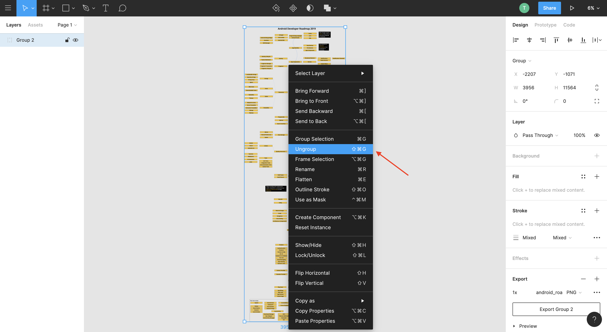

# Contributing to Android Developer Roadmap 2020

**For the english version, [click here](./contributing.md)**

## Gerando discussões

Se você tem alguma sugestão sobre algo que deveria estar no roadmap e caso você queira validar isso, nos recomendamos fortemente que você crie uma `issue` no nosso repositório. Dessa forma, nós conseguimos criar discussões ricas que certamente ajudarão várias pessoas sobre a adoção do conteudo no seu desenvolvimento.

## Criando melhorias

Se você tem alguma melhoria que você quer fazer diretamente no roadmap, nós recomendamos que você crie um `pull request` com basicamente dois arquivos: a **imagem do roadmap** e o **arquivo .fig**, ambos atualizados. Tente ser descritivo no seu PR, assim poderemos analisar e discutir sobre o que você está propondo.

### Usando o Figma

Nosso projeto é construído com o [Figma](https://www.figma.com/). Figma é uma ferramenta gratuita usada para construir protótipos, o que torna a melhor escolha para nosso roadmap, uma vez que a ideia aqui é que todas as pessoas possam utilizar a ferramenta e melhorar o conteúdo.

1. **Importando o roadmap**

    Depois de clonar o repositório, você deve encontrar dentro de `project` o arquivo `Android Developer Roadmap 2020.fig`. Com esse arquivo, você pode importar o projeto no seu perfil do Figma para editá-lo.

    

2. **Acessando e editando o conteúdo**

    Depois de fazer upload do arquivo, você pode acessar o conteúdo com um duplo clique em `Android Developer Roadmap 2020`. Com o clique do botão direito, você deverá fazer ungroup do conteúdo para ter acesso à cada componente para assim editá-lo.

    

    Agora você pode clicar em cada componente, componente interno e tudo mais para fazer as mudanças que você desejar. Note que nós temos um componente master (a caixa com o conteúdo `Programming Language`) e mudando ele as mudanças serão aplicadas em cada um dos outros componentes.

3. **Exportando as mudanças**

    Depois de atualizar o conteúdo, você deverá `exportar o arquivo .fig`. Você pode fazer isso clicando no `menu à esquerda > file > Save as .fig...`.

    

    Como parte do pull request, você precisa enviar também a imagem atualizada. Para fazer isso, você deverá `agrupar o conteúdo` com os mesmos passos que você fez para fazer o ungroup. Depois disso, você pode notar que a opção `export` vai ser exibida no menu da direta, na parte inferior. Clique no `+`, preencha o Sufix, mantenha o formato `PNG` e clique em `Export Group x`. A imagem será baixada.

    

    O padrão que estamos usando para o arquivo .fig é `Android Developer Roadmap 2020.fig` e para a imagem é `android_roadmap.png`. Você deve utilizar o mesmo padrão.

## Nos dê feedbacks!

Esse arquivo foi útil? Você teve alguma dificuldade para fazer suas atualizações ou sugestões? Por favor, nos informe! Com sua ajuda nós podemos não apenas melhorar o roadmap mas também esse passo a passo sobre como fazer melhorias conosco.